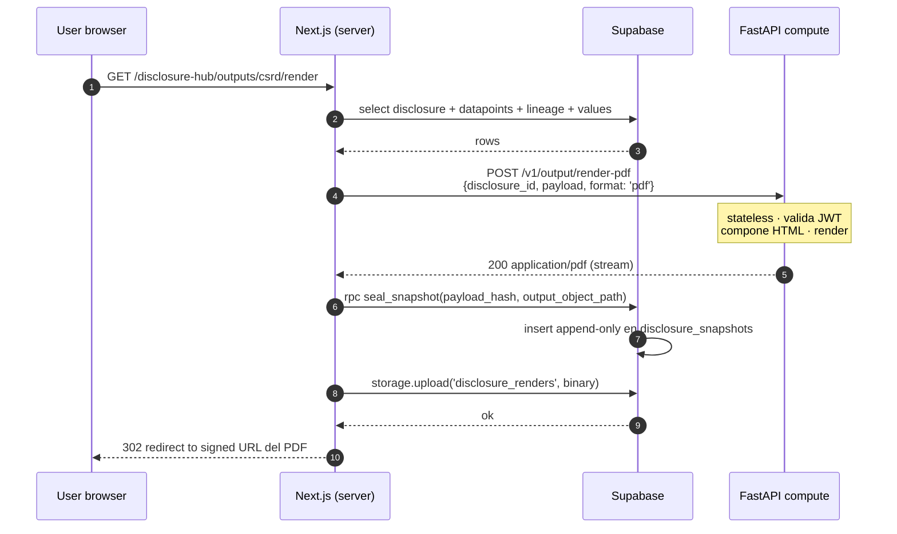

# Backend Split · Supabase ↔ FastAPI

> **Status:** decisión cerrada · cierra el bloqueo de Phase 8.
> **Owner:** plataforma / arquitectura.
> **Versión:** 1.0 · 2026-05-14.
> **Trazabilidad:** [`SCALABILITY.md` §18.5](../../SCALABILITY.md#185--frontera-supabase--fastapi--nuevo-714--s).

E6.0 ejecuta sobre **dos servicios backend con responsabilidades disjuntas**. Este documento es el contrato — cualquier discusión sobre "¿esto va en Supabase o en FastAPI?" se resuelve aquí.

---

## 1. TL;DR

| Servicio | Estado | Hosting | Responsabilidad | Stateful |
|---|---|---|---|---|
| **Supabase** | Existe, en uso desde 11 may 2026 | Managed (EU, region pinada) · `nodhlwslrxuekmhluldr` | Todo lo **transaccional + auth + RLS + real-time** | Sí — source of truth |
| **FastAPI compute** | Futuro · llega cuando entre Phase 8.8 | Auto-host EU (Fly.io / Hetzner / Scaleway / AWS eu-west) | Todo lo **compute pesado y stateless** | **No** — sin estado, no persiste |
| **Frontend (Next.js)** | En `e60-frontend` · App Router | Vercel EU | **Orquesta** ambos: lee de Supabase, envía payload a FastAPI, persiste el resultado en Supabase | — |

Regla mnemónica: **Supabase recuerda · FastAPI calcula · Next orquesta**.

---

## 2. Decisiones-clave (cerradas)

1. **Single source of truth = Supabase.** El estado canónico de cualquier entidad (datapoints, valores, emission entries, disclosures, snapshots, audit log) vive en Postgres con RLS. Cualquier copia derivada (caché, snapshot, render) referencia la versión Supabase por id + hash.
2. **FastAPI es trivialmente escalable horizontal.** No toca Supabase directamente, no conoce RLS, no mantiene cola interna persistente. Si necesita procesar algo asíncrono usa la cola de Supabase (`pg_cron` + tabla `compute_jobs`) o un broker externo (RabbitMQ/SQS) que **el frontend o un worker dedicado controlan**, no FastAPI mismo.
3. **Frontend orquesta.** Patrón: `(1) read from Supabase` → `(2) post payload to FastAPI` → `(3) write result back to Supabase` (vía RPC append-only para snapshots, vía PostgREST insert para entries calculados). FastAPI nunca llama a Supabase para escribir.
4. **OpenAPI contract por servicio.** Tipos generados con `openapi-typescript` en compile time. Cualquier ruptura de contrato falla `pnpm type-check` en CI antes de mergear.
5. **Auth federada.** FastAPI **verifica el JWT de Supabase** (Supabase RS256, JWKS público) en cada request. No tiene su propia tabla de usuarios. El claim `sub` y los memberships del usuario viajan en el payload cuando hace falta autorizar a nivel de entidad.

---

## 3. Qué vive en cada lado

### 3.1 · Supabase — transaccional

**Auth & identity:**
- `auth.users` (Supabase Auth managed).
- `user_org_memberships`, `user_entity_memberships` (RLS interna por banco · §18.4 SCALABILITY).
- Sessions via cookie httpOnly (Next middleware con `updateSession`).

**Catálogos read-mostly (RLS `authenticated using true`):**
- `datapoints` (1184 EFRAG IG3) · `emission_factors` (41 MITECO/IDAE/DEFRA) · `nace_sectors` (52) · `industry_materiality` (232) · `pillar_tbls` (10 EBA).

**Mutables (RLS scoped a user_id / entity_id):**
- `emission_entries` (con `disclosure_bindings text[]`, `operational_unit_id`) · `materiality_scores` · `iros` + `iro_datapoints` · `pillar_tbl_signoffs` · `connector_syncs` · `portfolio_exposures` · `operational_units` · `user_org_memberships`.

**Próximas tablas (Phase 8+):**
- `disclosure_snapshots` (append-only, §18.7) · `evidence_objects` (metadata; el binario va a Supabase Storage) · `audit_events` (single sink central, §7.6 / §10.1) · `entities` + `consolidation_groups` + `consolidation_members` (§18.4).

**Storage buckets:**
- `connector_uploads` (raw CSVs) · `evidence` (docs + screenshots adjuntos a datapoints) · `disclosure_renders` (PDFs/Word generados por FastAPI, persistidos aquí post-compute).

**Capabilities Supabase-only:**
- **RLS** (row-level security) en cada tabla mutable.
- **Realtime** (Postgres logical replication → ws) para system-online status, comments live, approval notifications.
- **Edge Functions** (Deno) — uso muy puntual, solo para webhooks que necesiten escribir a Postgres (e.g. callbacks de proveedores externos). **No** las usamos para compute — eso es FastAPI.

### 3.2 · FastAPI compute — stateless

**Casos de uso:**

| Endpoint | Input | Output | Latencia esperada |
|---|---|---|---|
| `POST /v1/output/render-pdf` | `{ disclosure_id, payload, format: 'pdf' \| 'docx' \| 'xbrl' }` | binary stream + content-type | 5-30 s |
| `POST /v1/narrative/generate` | `{ disclosure_id, datapoints[], style, locale }` | `{ markdown, model_used, token_count }` | 10-60 s (LLM) |
| `POST /v1/pcaf/financed-emissions` | `{ exposures[], factors[], method: 'asset-class' }` | `{ rows[], totals, dq_rating }` | 1-5 s |
| `POST /v1/climate/var` | `{ scenario: 'NGFS_Net_Zero_2050' \| ..., portfolio_id, horizon }` | `{ par_t, ead_t, expected_loss }` | 30 s-2 min |
| `POST /v1/connectors/csv/validate` | `{ template_id, raw_csv }` | `{ valid_rows[], errors[], preview }` | < 5 s |
| `POST /v1/snapshots/hash` | `{ payload }` | `{ sha256, canonical_form }` | < 100 ms |

**Lo que FastAPI NO hace:**
- ❌ No abre conexión a Supabase Postgres directamente.
- ❌ No mantiene sesiones de usuario.
- ❌ No corre cron interno (use `pg_cron` en Supabase o un orchestrator externo si llega el caso).
- ❌ No escribe a Supabase Storage directo (devuelve binary, el frontend lo sube a Storage post-respuesta).
- ❌ No conoce RLS — el frontend ya autorizó el read antes de enviar el payload.

**Stack interno FastAPI (propuesto):**
- Python 3.12 + FastAPI 0.115+ + Uvicorn workers.
- `pydantic` v2 para schemas (input/output).
- `pyjwt[crypto]` para verificar JWT Supabase.
- Render PDF: `weasyprint` (HTML → PDF) o `playwright` (HTML → PDF) según fidelidad.
- LLM: `anthropic` SDK + fallback a `openai` (Phase 8.9 decide proveedor).
- PCAF math: `numpy` + `pandas` ad-hoc.
- Climate VaR: `statsmodels` + factores externos NGFS.

---

## 4. Flujo de referencia · Output Generator (Phase 8.8)



**Notas:**
- FastAPI **devuelve el binario**, el frontend lo sube a Supabase Storage. Esto mantiene a FastAPI sin acceso a Storage.
- El `seal_snapshot` RPC en Supabase es append-only por RLS — el frontend no puede modificar snapshots, sólo crear.
- Si FastAPI cae a mitad, el `seal_snapshot` no ocurre → no hay registro inconsistente; el frontend reintenta.

---

## 5. Contrato OpenAPI por servicio

### 5.1 · Estructura en `packages/api-client`

Hoy `packages/api-client` apunta sólo a Supabase. Cuando entre FastAPI se reorganiza:

```
packages/api-client/
  openapi/
    supabase.yaml          # generado con `supabase gen types` + custom RPC schemas
    compute.yaml           # generado del FastAPI con /openapi.json
  src/
    supabase/
      index.ts             # PostgREST client wrappers + hooks TanStack Query
      types.ts             # types autogenerados
    compute/
      index.ts             # fetch wrappers contra FastAPI con auth header
      types.ts             # types autogenerados
    hooks/
      index.ts             # re-exports cohesivos: useDatapoints, useRenderPdf, etc.
```

**Generación de tipos:**

```bash
# Supabase
pnpm --filter @e60/api-client gen:supabase
# corre supabase gen types typescript --project-id nodhlwslrxuekmhluldr

# FastAPI
pnpm --filter @e60/api-client gen:compute
# corre openapi-typescript http://localhost:8000/openapi.json -o src/compute/types.ts
```

CI corre ambos con `--check` mode para fallar el build si los tipos generados drifteo del repo.

### 5.2 · Naming + versioning

- Endpoints versionados con prefijo: `/v1/output/render-pdf`. Bump major (`/v2/...`) cuando rompamos contrato. El frontend importa explícitamente la versión.
- Schemas pydantic se traducen 1:1 a TypeScript via `openapi-typescript`. Convención: `InputSchema` + `OutputSchema` por endpoint para que el `import type` lea natural.

---

## 6. Auth · cómo FastAPI valida sin tocar Supabase

1. Supabase Auth emite JWT firmado con **RS256** (par de claves `kbid` published en `https://<project>.supabase.co/auth/v1/.well-known/jwks.json`).
2. FastAPI carga las JWKS en startup (cacheado en memoria con TTL 1h, refresh on miss).
3. Cada request lleva `Authorization: Bearer <jwt>`. Middleware FastAPI:
   - Verifica firma + `exp` + `iss = https://<project>.supabase.co/auth/v1`.
   - Extrae `sub` (user_id) + `app_metadata` (roles si están).
4. Para autorización a nivel de entidad (e.g. "este user puede renderizar el snapshot del banco X"), el frontend envía los memberships relevantes **en el payload**, no en el JWT. FastAPI verifica que el `disclosure_id` solicitado pertenece a una entidad que el user puede leer — si miente, el read previo en Supabase ya habría fallado por RLS, así que FastAPI confía en que el payload es coherente con lo que el user ya pudo leer.

**Por qué no traerse memberships en cada request a FastAPI:** sería costoso (necesita Supabase) y duplica la fuente de verdad. Mantenerlo en el payload lo deja stateless.

---

## 7. Reglas de evolución

- **Si una feature necesita estado persistente** entre llamadas → vive en Supabase (tabla mutable + RLS + Realtime si aplica). No inventar tabla en FastAPI.
- **Si una feature necesita compute > 2 s o no determinístico** (LLM, render, simulación) → vive en FastAPI. No bloquear PostgREST con funciones pesadas.
- **Si una feature necesita ambos**: el frontend orquesta. Caso típico — output engine de §4 arriba.
- **Edge Functions Supabase** sólo para integraciones que terceros invocan directamente (webhooks). No las usamos como sustituto de FastAPI.
- **Background jobs / cron** — `pg_cron` para things ligeros (refresh de catálogos, cleanup); un worker dedicado consume `compute_jobs` de Supabase + invoca FastAPI cuando llegue el caso.

---

## 8. Migration plan · cuándo y cómo introducimos FastAPI

Hoy no existe servicio FastAPI. Sequence:

1. **Phase 7** — este doc + scaffold mínimo en `packages/api-client/src/compute/` (vacío, sólo tipos placeholder). Sin servicio levantado todavía.
2. **Phase 8.8** — primer endpoint: `POST /v1/output/render-pdf`. Repo `marcosrl94/E60-compute` (nuevo) con FastAPI estructura base + 1 endpoint + CI propio.
3. **Phase 8.9** — `/v1/narrative/generate`.
4. **Phase 13.3-13.4** — endpoints PCAF + GAR/BTAR + Taxonomy screener.
5. **Phase 12** — endpoints climate (VaR, scenarios).
6. **Phase 9 connectors** — `/v1/connectors/csv/validate` + parsers específicos.

Cada nuevo endpoint añade entrada en `compute.yaml` y se regenera tipos. El frontend nunca llama directo a FastAPI desde un client component sin pasar por la capa `@e60/api-client/compute.*` — la regla evita que las URL del servicio leak al bundle del browser.

---

## 9. Open questions

1. **Async compute** — para climate VaR (hasta 2 min) bloquear un request HTTP es feo. ¿Endpoint sincrónico con polling vs. job queue? Decisión cerrar antes de Phase 12.
2. **Idempotency keys** — los renders y los compute deberían ser idempotent. Header `Idempotency-Key` con UUID v4 del lado frontend, FastAPI cachea respuesta 5 min. Confirmar política de TTL antes de Phase 8.8.
3. **Rate limits** — quién decide qué tier de límites tiene cada banco. Hoy no aplica.
4. **Observability** — Sentry y tracing tags. Phase 7.13 lo cierra.

---

## 10. Referencias

- [`SCALABILITY.md` §18.5](../../SCALABILITY.md#185--frontera-supabase--fastapi--nuevo-714--s) — audit que origina este documento.
- [`SCALABILITY.md` §4.8](../../SCALABILITY.md#48--output-generator-real--l--packagesoutput-engine-nuevo) — Phase 8.8 output engine.
- [`SCALABILITY.md` §18.7](../../SCALABILITY.md#187--immutable-snapshots-por-filing--nuevo-85b) — disclosure snapshots inmutables, dependen de este split.
- [Supabase JWT verification reference](https://supabase.com/docs/guides/auth/jwts).
- [GHG Protocol Scope 2 Guidance · location vs market](https://ghgprotocol.org/scope-2-guidance) — relevante para PCAF endpoints.
